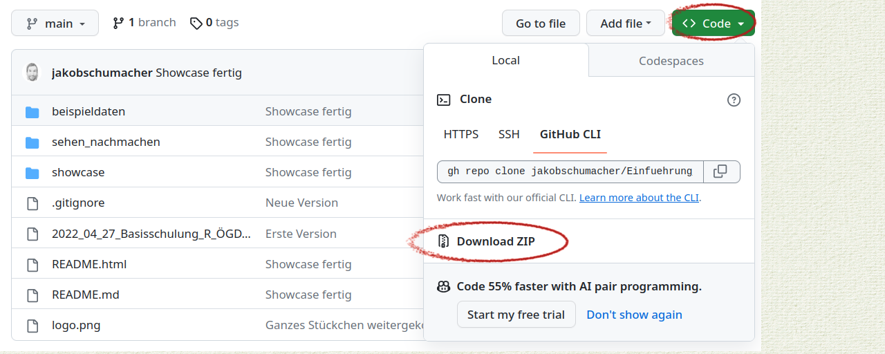

<div id="header" align="center">

</div>


In der Fortbildung lernen Sie die Programmiersprache R und die Entwicklungsumgebung RStudio kennen. Der R-Kurs ist für den Öffentlichen Gesundheitsdienst (ÖGD) gedacht. Dieses Repository enthält Begleitmaterialien zum Präsenzkurs an der [Akademie für öffentliches Gesundheitswesen](https://www.akademie-oegw.de/).   

__Link zur Anmeldung zum Präsenzkurs__  
Herbst 2023 [https://www.akademie-oegw.de/fortbildung/details/e-132023](https://www.akademie-oegw.de/fortbildung/details/e-132023)

__Inhalte der Schulung__  
In der Fortbildung erhalten Sie neben einer kurzen Einführung in die Grundlagen der Programmierung mit Base R, eine theoretische und praktische Einführung in die moderne Datenanalyse mit Tidyverse: Sie lernen Daten einzulesen, mit tidyr umzustrukturieren und mit dplyr zu verarbeiten und zu aggregieren. Außerdem lernen Sie in Ansätzen ggplot2 Grafiken und die Anwendung von R Markdown kennen. Begleitend erhalten Sie einen Einblick in einfache statistische Auswertungen mit R.

Neben den theoretischen Einblicken, werden wir von Beginn an praktisch arbeiten und Sie erlernen, wie aus einem R-Skript ein Kurzbericht entstehen kann. Am zweiten Tag können Sie das Erlernte mit Ihren eigenen Daten nachvollziehen. Bringen Sie deshalb bitte einen eigenen Datensatz und eine einfache eigene Fragestellung zur Bearbeitung und Auswertung ihrer Daten mit.

__Voraussetzungen__
Die Fortbildung richtet sich vor allem an Anfänger:innen, es sind keine Vorkenntnisse in R notwendig - Basiskenntnisse der Statistik sind jedoch von Vorteil. Ein Laptop auf dem R installiert ist (möglichst >= R version 4.1.3) und RStudio (möglichst >= 2022.07.1).

__Tag 1__  

* Begrüßung und Einführung in den Kurs
* SHOWCASE: Vom [R-Script](showcase/Showcase_OEGD_Bericht.Rmd) zum [HTML-Bericht](showcase/Showcase_OEGD_Bericht.html) oder [PDF-Bericht](showcase/Showcase_OEGD_Bericht.pdf)
* SETUP: Installation und Kennenlernen von RStudio
  * Installation von R und RStudio falls noch notwendig
  * Was ist R?
  * Wie ist RStudio aufgebaut?
* [SEHEN & NACHMACHEN 1: Variablentypen und einfache Operationen](sehen_nachmachen/1_Variabltentypen_und_einfache_operationen.R)  
* [SEHEN & NACHMACHEN 2: R-Packages Tidyverse Ggplot2](sehen_nachmachen/2_Packages_Tidyverse.R)  
* [SEHEN & NACHMACHEN 3: Daten einlesen und transformieren](sehen_nachmachen/3_Daten_lesen_transformieren.R)  
* [SEHEN & NACHMACHEN 4: Grafiken und Bericht erstellen](sehen_nachmachen/4_Grafiken_und_Bericht.Rmd)  

__Tag 2__  

* PRAXIS: Freies Arbeiten mit R
* EXKURS 1: Github
* EXKURS 2: Kartenerstellung
* EXKURS 3: ChatGPT
* Resümee des Kurses und Abschluss

__Nach dem Kurs__

* [Handout der wichtigsten Inhalte des Kurses](handout_r-kurs.html)


## Benutzung
#### Variante 1: Gitrepository als ZIP herunterladen



#### Variante 2: Gitrepository clonen

1. Öffne RStudio
2. Gehe ins Terminal 
3. "Klonen des Repositorys"
```
git clone https://github.com/jakobschumacher/Einfuehrung_R_OEGD.git
```


## Ordnerstruktur
Dieses Repository enthält alle notwendigen Datein für den Kurs

* Ordner __Sehen_und_Nachmachen__: Hier sind Skripte enthalten, die am Tag 1 verwendet werden
* Ordner __Showcase__: Hier ist der Showcase für einen Bericht
* Ordner __Beispieldaten__: Hier sind Daten angelgt, die während des Kurses verwendet werden
  * __Datei INKAR.csv__  Die Datei stammt aus der [Datenbank INKAR](https://www.inkar.de/). Die Datei wurde von BBSR heruntergeladen. BBSR ist an der Erstellung dieses R-Scriptes nicht beteiligt.
  * __Datei SC2Hospitalisierungen.csv__ Diese Datei stammt vom [Robert Koch-Institut](rki.de).  

## Bildquellen und Credits
- Logo [Freelogodesign.org](https://www.freelogodesign.org/)  
- Hosting [Github.com](https://github.com)  
- Software R [R-Project.org](https://www.r-project.org/) und RStduio [Posit.com](https://posit.com)  
- Wichtigste R-Packages [Tidyverse](https://www.tidyverse.org/packages/), [sf](https://r-spatial.github.io/sf/), [pacman](https://github.com/trinker/pacman)
- Inhalte [Epidemiologist R Handbook](https://epirhandbook.com/en/), [R epidemics consortium](https://www.repidemicsconsortium.org/)
