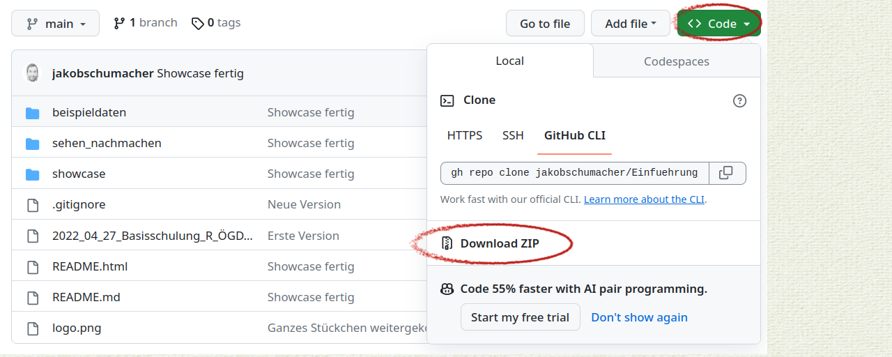

<div id="header" align="center">

</div>


In der Fortbildung lernen Sie die Programmiersprache R und die Entwicklungsumgebung RStudio kennen. Der R-Kurs ist für den Öffentlichen Gesundheitsdienst (ÖGD) gedacht. Dieses Repository enthält Begleitmaterialien zum Präsenzkurs an der [Akademie für öffentliches Gesundheitswesen](https://www.akademie-oegw.de/).   

__Link zur Anmeldung zum Präsenzkurs__  
[https://www.akademie-oegw.de/]https://www.akademie-oegw.de/) -> Suche nach "R Kurs"

__Inhalte der Schulung__  
In der Fortbildung erhalten Sie einen Überblick über die Programmiersprache R und die Entwicklungsumgebung RStudio. Die Fortbildung richtet sich vor allem an Anfänger:innen, es sind keine Vorkenntnisse in R notwendig - Basiskenntnisse der Statistik sowie Erfahrungen mit anderen syntaxbasierten Statistikprogrammen sind jedoch von Vorteil. Wir empfehlen das Epidemiologist R Handbook, welches als Open Access Publikation online verfügbar ist, zu nutzen. Vorbereitend empfehlen wir die Kapitel 1 bis 11 zu lesen.

In der Fortbildung erhalten Sie neben einer kurzen Einführung in die Grundlagen der Programmierung mit Base R, eine theoretische und praktische Einführung in die moderne Datenanalyse mit Tidyverse und RMarkdown. Wir folgen im Kurs den Schritten: 1) Daten einlesen, 2) Daten transformieren 3) Tabellen und Grafiken erstellen 4) Bericht erstellen. Diese Schritte werden immer wieder wiederholt: Im Showcase und in der Praxis beim Sehen und Nachmachen am ersten Veranstaltungstag, in den Übungen am zweiten Tag sowie als optionale Lehrwiederholung, die Sie zu Hause im Nachgang durchführen können. Für die praktischen Lerneinheiten können Sie unseren vorbereiteten Lehrdatensatz nutzen oder eigene Daten mitbringen. 

__Voraussetzungen__

1. R und RStudio installieren

Bitte bringen Sie einen Laptop mit, auf dem beides installiert ist – zuerst R, danach RStudio:

- **R**: über CRAN, <https://cran.r-project.org> → passendes Betriebssystem wählen. Empfohlen ist die jeweils aktuelle Version.
- **RStudio Desktop** (kostenlose Open-Source-Variante): <https://posit.co/download/rstudio-desktop/>. Empfohlen ist die aktuelle Version.

Die Reihenfolge ist wichtig: RStudio ist nur eine Oberfläche und findet beim ersten Start keine R-Installation, wenn R noch nicht vorhanden ist.

> Sollten Installationen auf Ihrem dienstlichen Rechner nicht möglich sein (fehlende Administrationsrechte, gesperrte Downloads), klären Sie das bitte frühzeitig mit Ihrer IT oder bringen Sie ein privates Laptop mit.


2. Pakete installieren

Kopieren Sie den folgenden Befehl in die **Console** (diese finden Sie in Rstudio in einem Tab zumeist links unten) und bestätigen Sie mit Enter:

```r
install.packages(c("tidyverse", "rmarkdown", "knitr", "sf", "pacman",
                   "gt", "leaflet", "DT", "geodata"))
```

Hinweise dazu:

- Der Befehl gehört in die Console, **nicht** in ein Skript oder einen R-Markdown-Chunk. Installiert wird einmalig
- Falls Sie nach einem CRAN-Mirror gefragt werden: einen beliebigen (z. B. Deutschland/Münster) auswählen.
- Sollte die Frage erscheinen, ob Pakete „from source" kompiliert werden sollen, antworten Sie mit **No** (bzw. `n`). Damit werden fertige Binärpakete installiert, was schneller und weniger fehleranfällig ist.
  
> Auf manchen Arbeitsrechnern ist die Installation von bestimmten Paketen nicht möglich, da diese bestimmte Software auf dem Arbeitsrechner voraussetzen. Wenn das der Fall ist lassen Sie diese zur Not weg. 

Melden Sie sich gern bei Fragen zu den notwendigen Installationen – am besten vor dem Kurstermin, damit wir im Kurs direkt starten können.

__Tag 1__  

* 10.00 Begrüßung und Einführung in den Kurs
* 10.15 SHOWCASE: Vom [R-Script](showcase/Showcase_OEGD_Bericht.Rmd) zum [HTML-Bericht](showcase/Showcase_OEGD_Bericht.html) oder [PDF-Bericht](showcase/Showcase_OEGD_Bericht.pdf)
* 10.45 [SETUP: Installation und Kennenlernen von RStudio]((setup/1_Variabltentypen_und_einfache_operationen.R))
  * Installation von R und RStudio falls noch notwendig
  * Was ist R?
  * Wie ist RStudio aufgebaut?
* 13.30 [SEHEN & NACHMACHEN 1: Daten einlesen](sehen_nachmachen/1_Daten_lesen_pakete.R)   
* 14.20 [SEHEN & NACHMACHEN 2: Daten transformieren](sehen_nachmachen/2_Daten_transformieren.R)  
* 16.30 [SEHEN & NACHMACHEN 3: Grafiken und Tabellen erstellen](sehen_nachmachen/3_Grafiken_Tabellen.R)  
* 17.15 [SEHEN & NACHMACHEN 4: Bericht erstellen](sehen_nachmachen/4_Bericht.Rmd)  

__Tag 2__  

* PRAXIS: Freies Arbeiten mit R
* EXKURS 1: Github
* EXKURS 2: Kartenerstellung
* EXKURS 3: ChatGPT
* Resümee des Kurses und Abschluss

__Nach dem Kurs__

* [Handout der wichtigsten Inhalte des Kurses](handout/handout_r-kurs.html)
* [Buch in deutsch](https://www.produnis.de/R/)
* [Data specialization als Vertiefung](https://www.coursera.org/specializations/jhu-data-science)

## Benutzung
#### Variante 1: Gitrepository als ZIP herunterladen



#### Variante 2: Gitrepository clonen

1. Öffne RStudio
2. Gehe ins Terminal 
3. "Klonen des Repositorys"
```
git clone https://github.com/jakobschumacher/Einfuehrung_R_OEGD.git
```


## Ordnerstruktur
Dieses Repository enthält alle notwendigen Datein für den Kurs

* Ordner __showcase__: Hier ist der Showcase für einen Bericht
* Ordner __setup__: Hier ist die Einführung in R
* Ordner __sehen_und_nachmachen__: Hier sind Skripte enthalten, die am Tag 1 verwendet werden
* Ordner __eigener_bericht__: Hier ist ein möglicher Bericht für den Tag 2
* Ordner __handout__: Hier ist eine Datei zur Hilfe angelegt
* Ordner __Beispieldaten__: Hier sind Daten angelgt, die während des Kurses verwendet werden
  * __Datei INKAR.csv__  Die Datei stammt aus der [Datenbank INKAR](https://www.inkar.de/). Die Datei wurde von BBSR heruntergeladen. BBSR ist an der Erstellung dieses R-Scriptes nicht beteiligt.
  * __Datei SC2Hospitalisierungen.csv__ Diese Datei stammt vom [Robert Koch-Institut](rki.de).  

## Bildquellen und Credits
- Logo [Freelogodesign.org](https://www.freelogodesign.org/)  
- Hosting [Github.com](https://github.com)  
- Software R [R-Project.org](https://www.r-project.org/) und RStduio [Posit.com](https://posit.com)  
- Wichtigste R-Packages [Tidyverse](https://www.tidyverse.org/packages/), [sf](https://r-spatial.github.io/sf/), [pacman](https://github.com/trinker/pacman)
- Inhalte [Epidemiologist R Handbook](https://epirhandbook.com/en/), [R epidemics consortium](https://www.repidemicsconsortium.org/)
